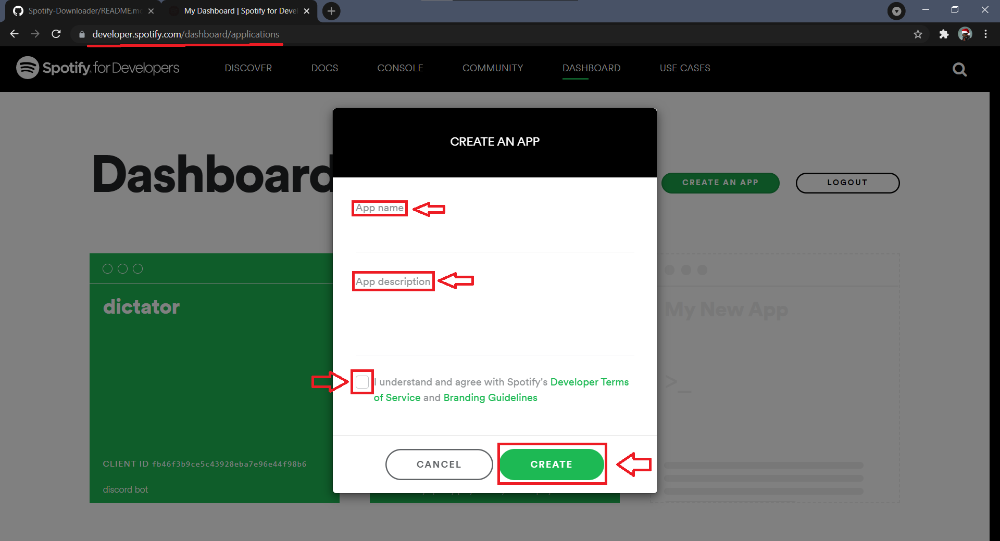

## Installation Guide 

1.  Go to [Spotify Developers](https://developer.spotify.com/dashboard/login) and LogIn from your Spotify Account

2. After Logging In from your Spotify Account create a new Application

3. Click on `Create An App` and you will see this page 

- An Example Image Has Been Provided 

4. After clicking on `Create` you will be redirected to this page 

5. Click on `SHOW CLIENT SECRET` highlighted in green text

6. Copy `Client ID` and `Client Secret` separately since they are needed later on

7. Then go to the [GitHub Repository](https://github.com/Reverend-Toady/Spotify-Downloader) Main Page  and click on `Code` highlighted in green

8. After clicking on `Code` you will see something like this 

9. If you have [Git](https://git-scm.com/downloads) installed you can clone the repository `$git clone https://github.com/Reverend-Toady/Spotify-Downloader.git`

10. If you don't, no need to worry click on `Download ZIP` to download the zip file

11. Then go to where you have downloaded/cloned the repository 

12. Open up client secrets, if you don't have the option to open it download [Notepad ++](https://notepad-plus-plus.org/downloads/) from its website or from Microsoft Store

13. Edit the `MY_SECRETS.json` file in this format

14. Fill up the `Client ID` in the provided green `"FILL CLIENT ID HERE"` parameter

15. Fill up the `Client SECRET` in the provided green `"FILL CLIENT SECRET HERE"` parameter

- NOTE: DO NOTE CHANGE THE FORMAT OF THE FILE
- NOTE: KEEP THE DOUBLE QUOTES INTACT

16. Save the file and open up your preferred command line, in this case ill be using the command promt

17. Traverse to where you downloaded the repository `cd` command to go to a folder, in my case `cd Projects` `cd Python_Projects` `cd SpotifyDownloader` did the job 

18. To view the help page, run `py main.py -h`

19. To run the program, run `py main.py -u URL-TO-PLAYLIST -p LOCATION-WHERE-YOU-WANT-TO-DOWNLOADE-SONGS/PATH`

- NOTE: FOR THIS TO WORK YOU MUST HAVE PYTHON DOWNLOADED
- NOTE: IF YOU FACE ANY ISSUES FEEL FREE TO CONTACT ME